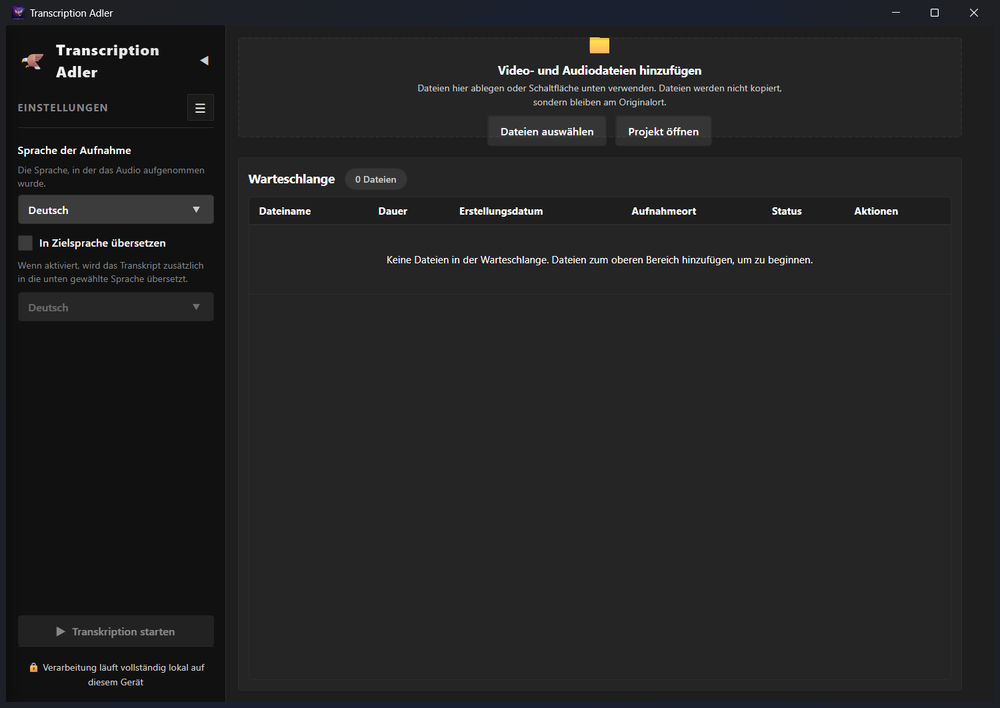
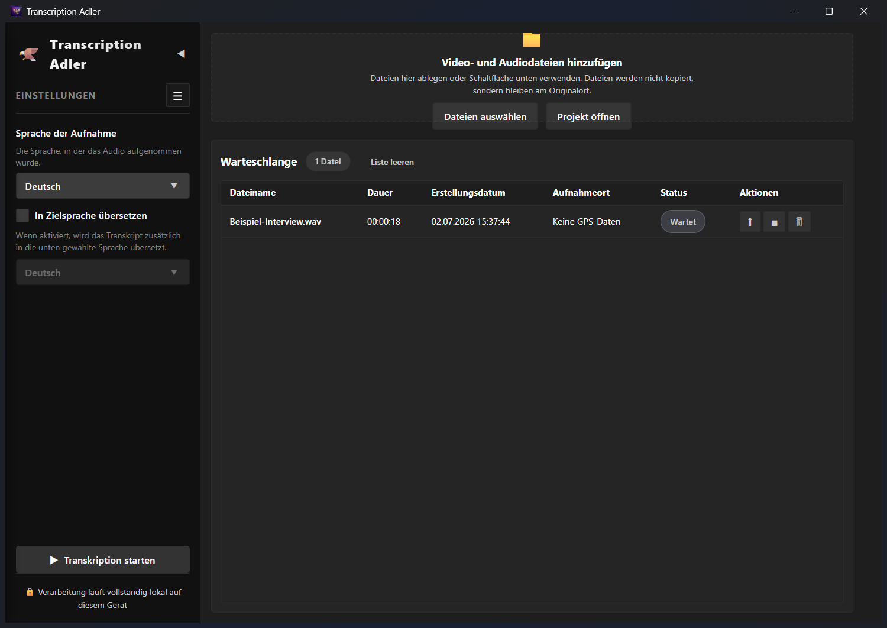
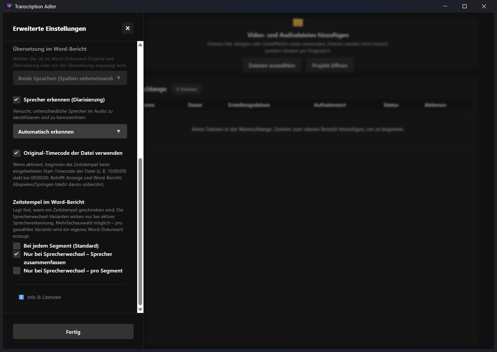
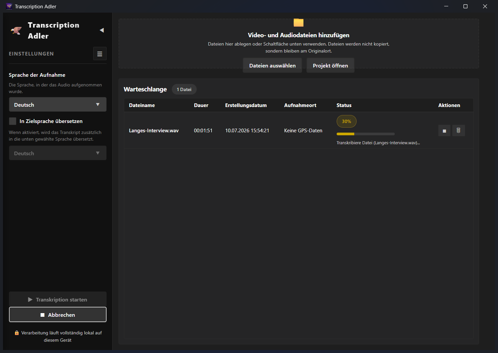
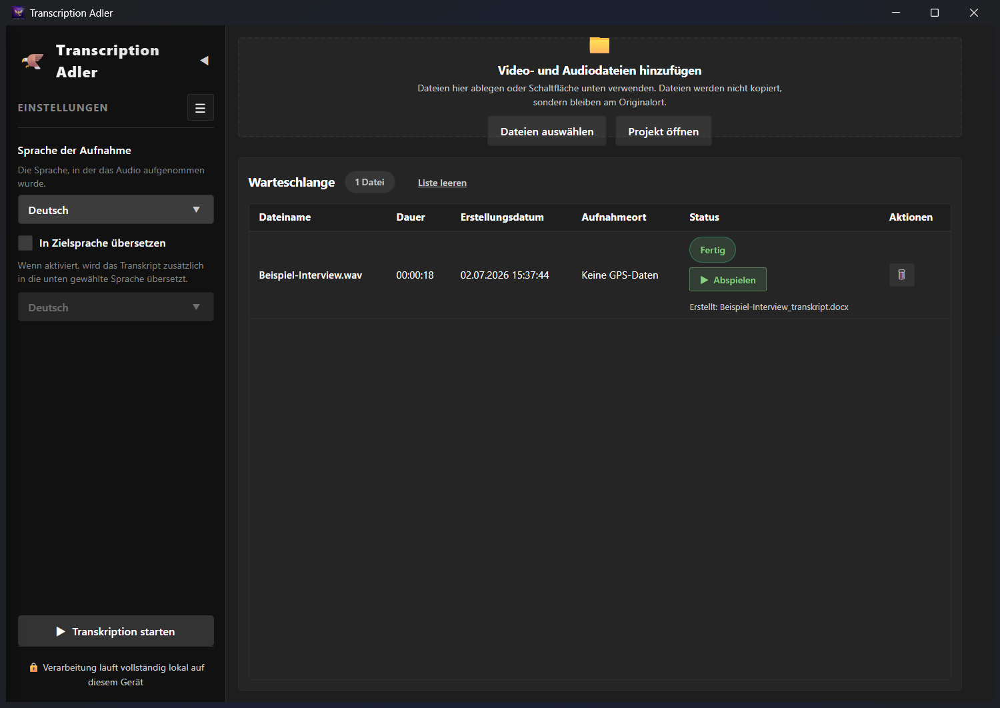
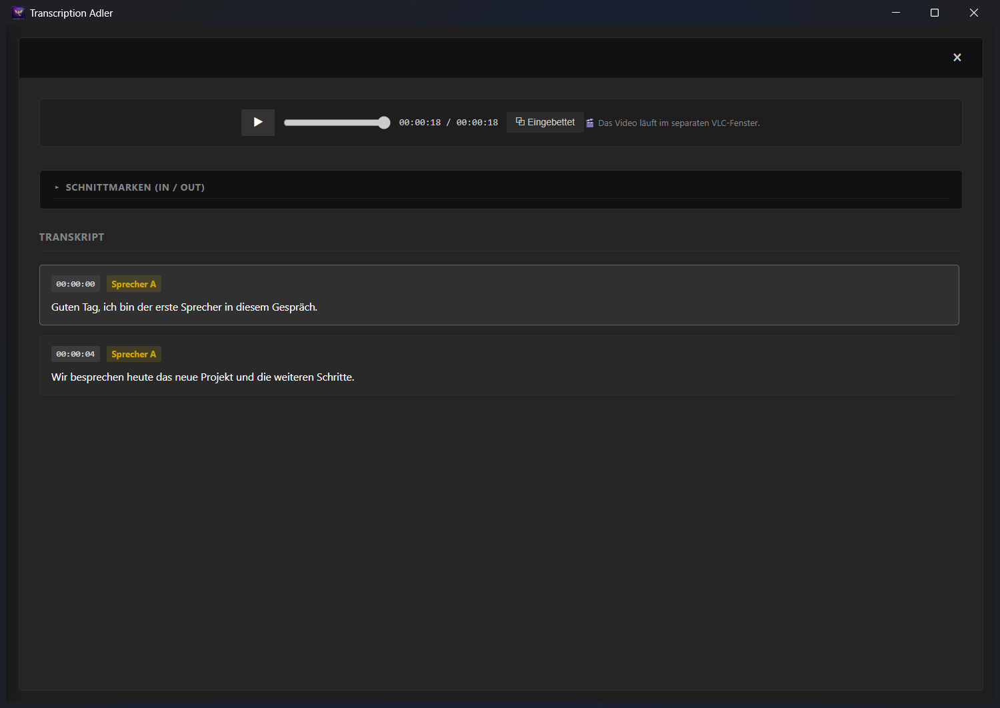
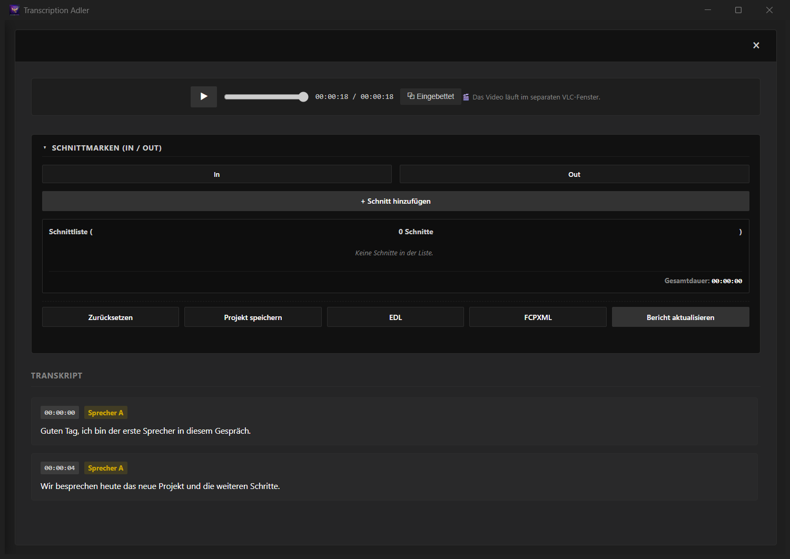
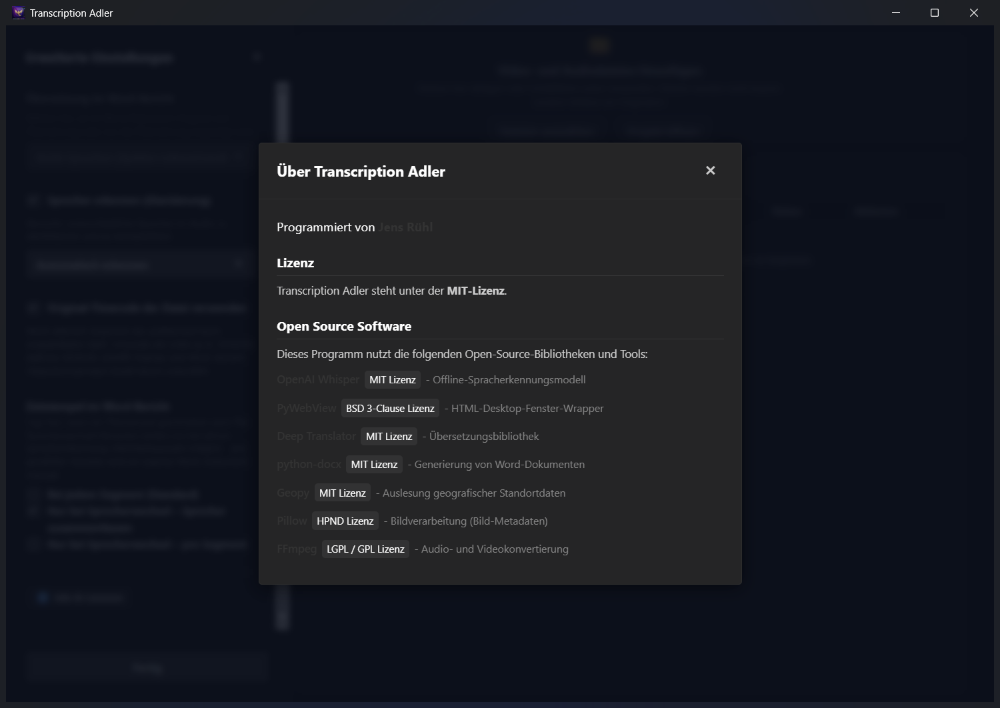

# Transcription Adler – Bedienungsanleitung

Transcription Adler transkribiert und übersetzt Audio- und Videodateien **vollständig offline** auf deinem eigenen Rechner mit OpenAI Whisper. Zusätzlich erkennt die App Sprecher, liest Metadaten aus, erzeugt einen formatierten **Word-Bericht** und bietet einen Player mit Schnittlisten-Export (EDL/FCPXML).

> **Datenschutz:** Die **Transkription** läuft komplett lokal – es werden keine Audiodaten ins Internet geladen. Nur die optionale **Übersetzung** nutzt einen Online-Dienst (Google Übersetzer); dabei wird der erkannte *Text* übertragen. Ohne aktivierte Übersetzung verlässt nichts den Rechner.

---

## Inhalt

1. [Installation & Start](#1-installation--start)
2. [Die Oberfläche im Überblick](#2-die-oberfläche-im-überblick)
3. [Dateien hinzufügen](#3-dateien-hinzufügen)
4. [Die Warteschlange](#4-die-warteschlange)
5. [Grundeinstellungen (Seitenleiste)](#5-grundeinstellungen-seitenleiste)
6. [Erweiterte Einstellungen](#6-erweiterte-einstellungen)
7. [Transkription starten & abbrechen](#7-transkription-starten--abbrechen)
8. [Der Word-Bericht](#8-der-word-bericht)
9. [Player & Transkript-Ansicht](#9-player--transkript-ansicht)
10. [Schnittmarken & Export](#10-schnittmarken--export)
11. [Barrierefreiheit](#11-barrierefreiheit)
12. [Info & Lizenzen](#12-info--lizenzen)
13. [Tipps & Hinweise](#13-tipps--hinweise)

---

## 1. Installation & Start

- **Installer:** `TranscriptionAdler_Setup.exe` ausführen und den Anweisungen folgen. Es sind **keine Administratorrechte** nötig; die App wird für den aktuellen Benutzer installiert. Alles Nötige (FFmpeg, VLC, Whisper-Sprachmodelle) ist enthalten – keine weitere Installation erforderlich.
- **Start:** über das **Startmenü** oder das **Desktop-Symbol** „Transcription Adler".
- **Unterstützte Formate:** siehe [Abschnitt 3](#3-dateien-hinzufügen) – praktisch alle gängigen Video- und Audioformate.

> Beim ersten Start auf fremden Rechnern kann Windows „Unbekannter Herausgeber" melden (die App ist selbstsigniert). Über **„Weitere Informationen → Trotzdem ausführen"** startet sie normal.

---

## 2. Die Oberfläche im Überblick

Das Fenster ist zweigeteilt:

- **Links – Einstellungen:** Sprache der Aufnahme, Übersetzung und (über das Menü-Symbol ☰) die erweiterten Einstellungen. Ganz unten der Button **„Transkription starten"**.
- **Rechts – Arbeitsbereich:** Oben der Bereich zum **Hinzufügen** von Dateien, darunter die **Warteschlange** mit allen Dateien und ihrem Status.

Mit dem kleinen Pfeil **◀** neben dem Logo lässt sich die Einstellungs-Leiste ein- und ausklappen.

---

## 3. Dateien hinzufügen

Es gibt drei Wege:

1. **Ziehen & Ablegen** – Dateien direkt in den oberen Bereich „Video- und Audiodateien hinzufügen" ziehen.
2. **„Dateien auswählen"** – öffnet einen Dateidialog (Mehrfachauswahl möglich).
3. **„Projekt öffnen"** – lädt eine gespeicherte `.adler`-Projektdatei samt Transkript, Video-Verknüpfung und Schnittmarken.

> Die Originaldateien werden **nicht kopiert oder verändert** – sie bleiben an ihrem Speicherort. Die App merkt sich nur den Pfad.

### Welche Dateien lassen sich transkribieren?

Für die Transkription wertet die App ausschließlich die **Tonspur** aus – der Video-Codec spielt dabei **keine Rolle**. Verarbeitet werden kann alles, was das mitgelieferte FFmpeg lesen kann:

| Bereich | Formate |
|---|---|
| **Video** | `.mp4` `.mov` `.m4v` `.mkv` `.webm` `.avi` `.wmv` `.asf` `.flv` `.ts` `.m2ts` `.mts` `.3gp` sowie **`.mxf`**, `.gxf`, `.lxf` (Broadcast) |
| **Audio** | `.wav` `.mp3` `.m4a` `.aac` `.flac` `.aiff` `.ogg` `.opus` `.wma` `.caf` `.ac3` |
| **Projekt** | `.adler` (gespeicherte Projekte der App) |

Für die **Wiedergabe** im Player sind unter anderem H.264, H.265/HEVC, AV1, MPEG-2, **Apple ProRes** (auch RAW), **DNxHD/VC-3** und DV enthalten – ebenso alle PCM-Tonspuren (16/24/32 Bit, auch mehrkanalig).

> Der Dateidialog schlägt die gängigsten Endungen vor. Weitere Formate lassen sich über **„Alle Dateien"** im Dialog oder einfach per **Drag & Drop** laden.

---

## 4. Die Warteschlange

Für jede Datei zeigt die Tabelle:

| Spalte | Bedeutung |
|---|---|
| **Dateiname** | Name der Quelldatei |
| **Dauer** | Länge der Aufnahme |
| **Erstellungsdatum** | aus den Metadaten (oder Dateidatum) |
| **Aufnahmeort** | GPS-Ort aus den Metadaten, sonst „Keine GPS-Daten" |
| **Status** | Wartet / Prozent / Fertig / Fehler / Abgebrochen |
| **Aktionen** | Schaltflächen je nach Status |

**Aktions-Schaltflächen:**

- **⬆ Vorziehen** – die Datei als Nächstes bearbeiten (nur solange sie wartet).
- **■ Abbrechen** – die Transkription dieser Datei stoppen.
- **▶ Neu starten** – abgebrochene/fehlgeschlagene Datei erneut transkribieren.
- **🗑 Entfernen** – Datei aus der Liste nehmen.

Mit **„Liste leeren"** werden alle wartenden Einträge entfernt.

---

## 5. Grundeinstellungen (Seitenleiste)

- **Sprache der Aufnahme** – die gesprochene Sprache. Auf **„Automatisch erkennen"** stellen, wenn unbekannt.
- **„In Zielsprache übersetzen"** – aktiviert die Übersetzung. Erst dann lässt sich die **Zielsprache** darunter wählen.

> Übersetzung ins **Englische** übernimmt Whisper direkt (offline). Andere Zielsprachen laufen über den **Online-Übersetzer** und benötigen eine Internetverbindung.

---

## 6. Erweiterte Einstellungen

Über das Menü-Symbol **☰** neben „EINSTELLUNGEN" öffnet sich das Panel mit allen Detail-Optionen.

- **Whisper-Modellgröße** – *Tiny* (am schnellsten), *Base*, *Small* (genauer, langsamer). Größere Modelle liefern bessere Ergebnisse, brauchen aber mehr Zeit.
- **Sprachen verwalten** – zusätzliche **Erkennungs-** oder **Übersetzungssprachen** freischalten. Sie erscheinen danach in den Auswahlfeldern der Seitenleiste.
- **Speicherort für Berichte** – wohin der Word-Bericht gespeichert wird: *Desktop*, ein *eigener Ordner* oder *neben der Quelldatei*.
- **Übersetzung im Word-Bericht** – ob Original **und** Übersetzung nebeneinander oder nur die Übersetzung erscheint.

- **Sprecher erkennen (Diarisierung)** – erkennt und kennzeichnet unterschiedliche Sprecher (Sprecher A, B, C …). Darunter die **Sprecheranzahl**: *Automatisch erkennen* oder eine feste Zahl.
- **Original-Timecode der Datei verwenden** – Zeitstempel beginnen beim eingebetteten Start-Timecode der Datei (z. B. `10:00:00` bei Broadcast-Material) statt bei `00:00:00`. Betrifft Anzeige und Word-Bericht; Abspielen/Springen bleibt davon unberührt.
- **Zeitstempel im Word-Bericht** – legt fest, wann ein Zeitstempel geschrieben wird. **Mehrfachauswahl möglich** – pro gewählter Variante wird ein eigenes Word-Dokument erzeugt:
  - **Bei jedem Segment (Standard)**
  - **Nur bei Sprecherwechsel – Sprecher zusammenfassen** (fasst aufeinanderfolgende Segmente desselben Sprechers zu einem Block zusammen)
  - **Nur bei Sprecherwechsel – pro Segment**

  > Die Sprecherwechsel-Varianten wirken nur, wenn die **Sprechererkennung** aktiv ist.

Alle Einstellungen werden automatisch gespeichert und beim nächsten Start wiederhergestellt.

---

## 7. Transkription starten & abbrechen

Unten links **„Transkription starten"** klicken. Die App arbeitet die Warteschlange nacheinander ab und zeigt pro Datei einen Fortschrittsbalken.

Typische Schritte: *Metadaten analysieren → Whisper-Modell laden → transkribieren → Sprechererkennung → Word-Bericht erzeugen*.

- **„Abbrechen"** (unten) stoppt den gesamten Lauf; verbleibende Dateien werden übersprungen.
- Einzelne Dateien lassen sich über die **■**-Schaltfläche in ihrer Zeile stoppen.

Nach Abschluss steht in der Statusspalte **„Fertig"** und der Name des erzeugten Word-Berichts.

---

## 8. Der Word-Bericht

Für jede fertige Datei entsteht ein `.docx`-Bericht (Name: `<Dateiname>_transkript.docx`) am gewählten Speicherort. Er enthält:

- **Kopf mit Metadaten:** Dateiname, Dauer, Erstellungsdatum und – falls vorhanden – den **GPS-Ort** mit Link zu Google Maps.
- **Transkript-Tabelle:** Zeitstempel (und Sprecher, falls erkannt) neben dem Text. Bei aktivierter Übersetzung zusätzlich eine Spalte mit der Übersetzung.
- Sind **Schnittmarken** gesetzt (siehe Abschnitt 10), werden die betroffenen Bereiche im Bericht farblich hervorgehoben und mit `IN`/`OUT`-Markierungen versehen.

---

## 9. Player & Transkript-Ansicht

Ein Klick auf eine fertige Zeile oder auf **„▶ Abspielen"** öffnet die Detailansicht mit Player und synchronem Transkript.

- **Wiedergabe:** Play/Pause und Suchleiste oben. Das Video läuft in einem nativen VLC-Fenster (auch professionelle Codecs wie MXF).
- **⧉ Eingebettet / Eigenes Fenster** – schaltet um, ob das Videobild in die App eingebettet oder in einem eigenen Fenster angezeigt wird.
- **Transkript:** Jedes Segment zeigt Zeitstempel und – bei aktiver Diarisierung – den **Sprecher** (farbige Markierung). Ein **Klick auf ein Segment** springt im Player an diese Stelle.
- Bei aktivierter Übersetzung kann zwischen **Original**, **Übersetzung** und **beidem** umgeschaltet werden.

---

## 10. Schnittmarken & Export

Über **„▸ SCHNITTMARKEN (IN / OUT)"** klappt der Schnittbereich auf.

**Schnitte setzen:**

1. Im Player oder Transkript zur gewünschten Stelle gehen.
2. **„In"** setzt den Anfangspunkt, **„Out"** den Endpunkt (alternativ in einem Transkript-Segment die Tasten **←** für IN und **→** für OUT).
3. **„+ Schnitt hinzufügen"** übernimmt den Bereich in die **Schnittliste**.

Ein Klick auf einen Eintrag der Schnittliste springt zum Startpunkt; über **×** wird er gelöscht. **„Zurücksetzen"** leert die Liste.

**Weitergabe & Export:**

- **Projekt speichern** – legt eine `.adler`-Datei mit Transkript, Video-Verknüpfung und Schnittmarken an (später über „Projekt öffnen" wiederherstellbar).
- **Bericht aktualisieren** – erzeugt den Word-Bericht neu, mit den Schnittbereichen hervorgehoben.
- **EDL** – Schnittliste als CMX3600-EDL (für Adobe Premiere, Avid Media Composer, DaVinci Resolve).
- **FCPXML** – Schnittliste für Apple Final Cut Pro (auch von Premiere/Resolve lesbar).

> Quell-Timecodes der Exporte berücksichtigen den Start-Timecode und die Bildrate der Datei.

---

## 11. Barrierefreiheit

Die Oberfläche ist nach WCAG 2.1 AA gestaltet:

- Vollständige **Tastaturbedienung** (Tab, Enter/Leertaste; im Transkript **←/→** für IN/OUT).
- **Screenreader-Unterstützung** (ARIA-Beschriftungen und Live-Meldungen für NVDA, JAWS, Windows-Sprachausgabe).
- Hohe Kontraste, Unterstützung für „Reduzierte Bewegung" und den Windows-Hochkontrast-Modus.
- Bedienelemente mind. 44 × 44 px.

---

## 12. Info & Lizenzen

Über **„Info & Lizenzen"** unten in den erweiterten Einstellungen erscheinen Autor, Lizenz und die verwendeten Open-Source-Komponenten.

Transcription Adler steht unter der **MIT-Lizenz**.

---

## 13. Tipps & Hinweise

- **Schneller vs. genauer:** Für lange Aufnahmen zunächst **Tiny/Base** testen; für beste Qualität **Small** wählen.
- **Sprechererkennung** funktioniert am besten bei klar getrennten Stimmen und ausreichend langen Redeanteilen.
- **Übersetzung** braucht Internet und sendet den erkannten Text an den Online-Übersetzer – bei sensiblen Inhalten deaktiviert lassen.
- **Mehrere Zeitstempel-Varianten** gleichzeitig auswählbar – praktisch, um denselben Clip einmal ausführlich und einmal nach Sprecherblöcken zu erhalten.
- Alle Einstellungen bleiben über Sitzungen hinweg erhalten.

---

*Stand: Version 1.1*
